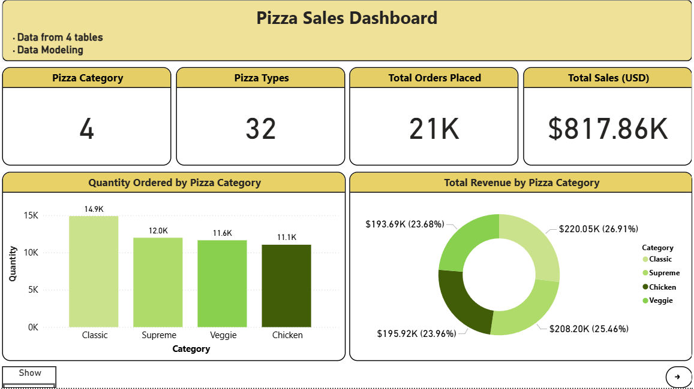
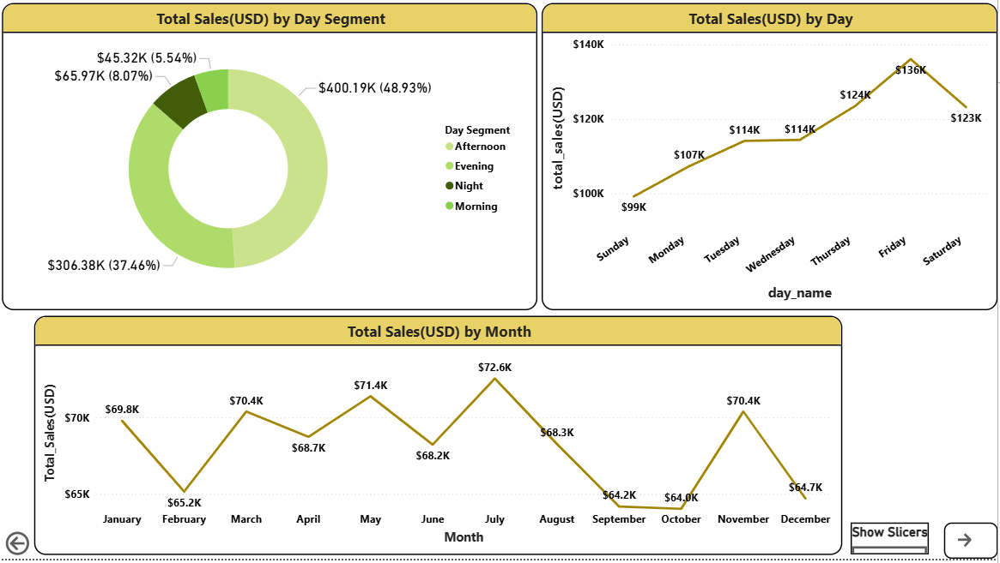
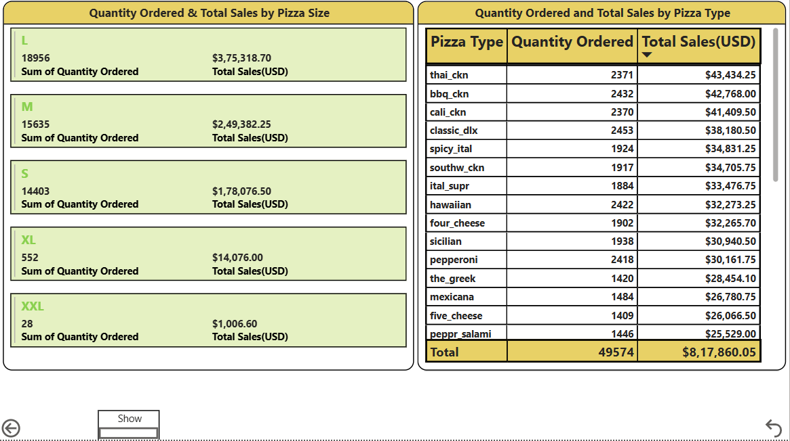

# Pizza_Sales_Dashboard
🍕 Pizza Sales Dashboard

An interactive Power BI dashboard that analyzes pizza sales performance — covering orders, revenue, pizza categories, sizes, and time-based trends — to help understand what's selling, when, and how much it's generating.

📊 Overview

This dashboard turns raw pizza order data into an interactive report across 3 pages, letting users explore sales performance from multiple angles: overall KPIs, time-based trends, and product-level breakdowns.

📁 Files

* File Description: Pizza_Sales_Dashboard.pbix  
* Power BI report file containing the data model, DAX measures, and report pages.

🧾 Data Model

The report is built on the following tables:

* orders – order-level data (order ID, date, time)  
* order_details – line items per order (pizza, quantity)  
* pizzas – pizza SKUs (size, price, linked pizza type)  
* pizza_types – pizza type/category master data (name, category)

📄 Report Pages

1. Overview

A high-level summary of sales performance, including:

KPI cards: Total Orders Placed, Total Sales (USD), Pizza Category, Pizza Types  
Column chart: Quantity Ordered by Pizza Category  
Donut chart: Total Revenue by Pizza Category  
Slicers: Day Segment, Month, Category, Size, Pizza Type 

2. Monthly and Day-wise Analysis

Time-based trend analysis, including:

Line chart: Total Sales (USD) by Month  
Line chart: Total Sales (USD) by Day  
Donut chart: Total Sales (USD) by Day Segment  
Slicers: Category, Size, Pizza Type  

3. Pizza Size & Pizza Type Analysis

Product-level breakdown, including:

* Multi-row card: Quantity Ordered & Total Sales by Pizza Size  
* Table: Quantity Ordered and Total Sales by Pizza Type  
* Slicers: Day Segment, Size, Category, Day Name, Month  

🛠️ Tools Used

* Power BI Desktop – data modeling, DAX measures, and report visualization

🚀 How to Use

* Download Pizza_Sales_Dashboard.pbix
* Open it in Power BI Desktop (free)
* Use the slicers on each page to filter by month, day segment, pizza category, size, or type
* Use the Show/Hide buttons to toggle the slicer panel on each page

📌 Key Insights Enabled

* Which pizza categories and types drive the most orders and revenue
* Sales trends across months, days of the week, and time-of-day segments
* Performance comparison across pizza sizes

📷 Preview

### Overview

### Monthly and Day-wise Analysis

### Pizza Size & Pizza Type Analysis

